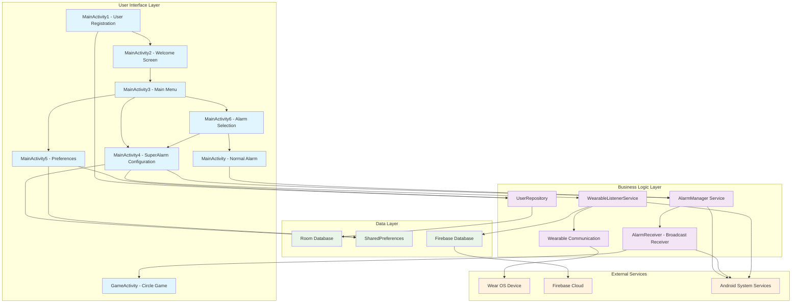
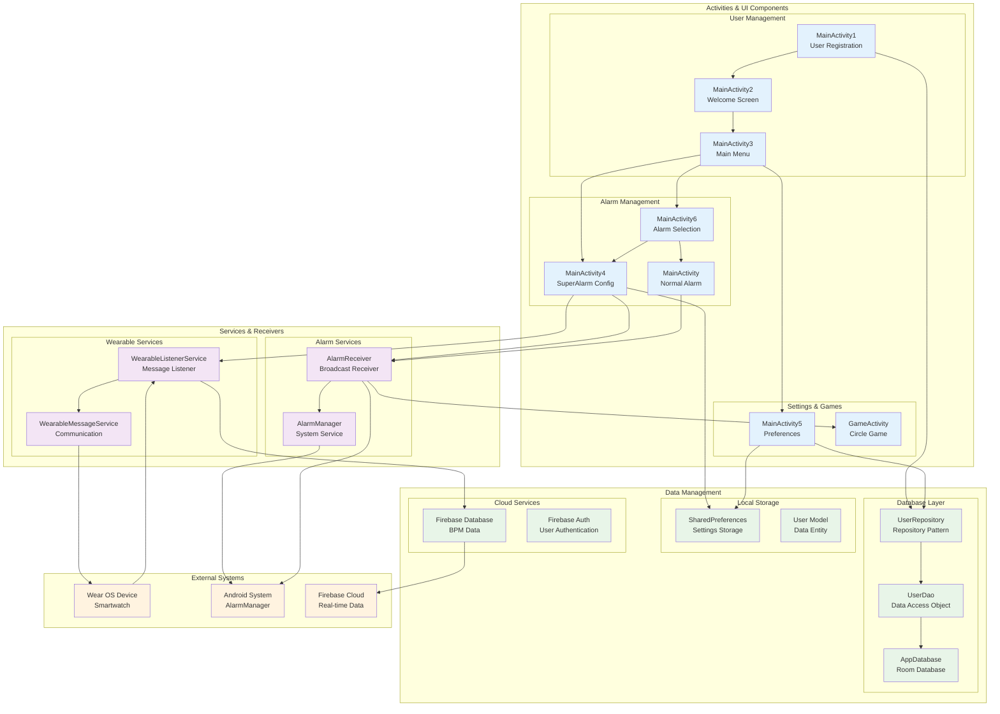
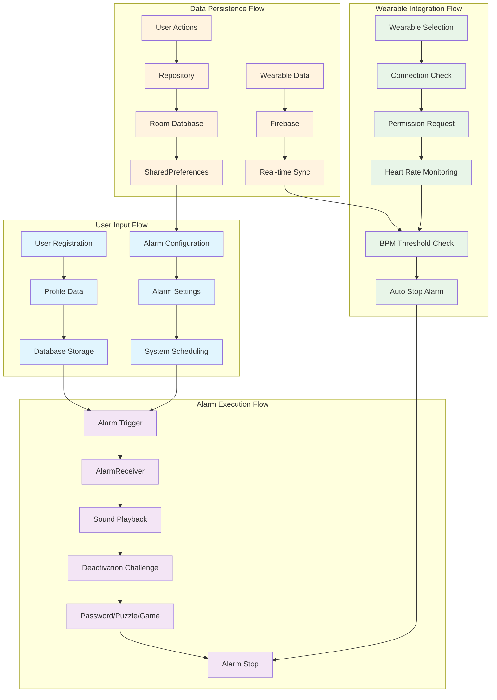
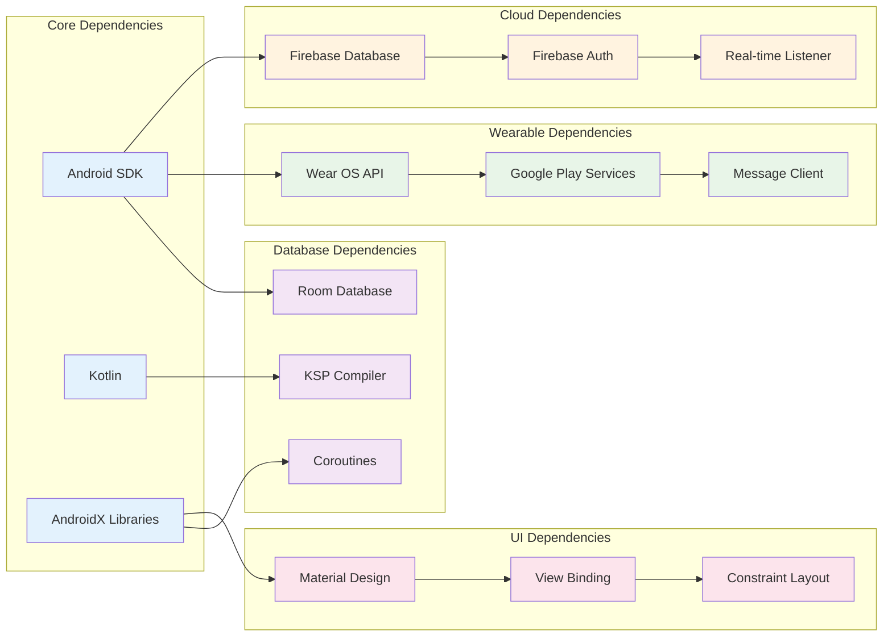

# SmaMySuperAlarm App Architecture Block Diagram

## High-Level System Architecture

## Detailed Component Architecture

## Data Flow Architecture

## Component Dependencies

## Key Features by Component

### Activities
- **MainActivity1**: User registration and profile creation
- **MainActivity2**: Welcome screen after registration
- **MainActivity3**: Main menu with navigation options
- **MainActivity4**: SuperAlarm configuration with wearable integration
- **MainActivity5**: User preferences and settings management
- **MainActivity6**: Alarm type selection (normal vs SuperAlarm)
- **MainActivity**: Standard alarm functionality
- **GameActivity**: Interactive alarm deactivation game

### Services
- **AlarmReceiver**: Handles alarm triggers and sound playback
- **WearableListenerService**: Manages wearable device communication
- **AlarmManager**: System-level alarm scheduling

### Data Layer
- **Room Database**: Local data persistence for user profiles
- **SharedPreferences**: Settings and configuration storage
- **Firebase Database**: Real-time BPM data from wearable devices
- **UserRepository**: Data access abstraction layer

### External Integrations
- **Wear OS**: Smartwatch communication and heart rate monitoring
- **Firebase**: Cloud-based real-time data synchronization
- **Android System**: Alarm scheduling and notification services

This architecture follows the MVVM (Model-View-ViewModel) pattern with Repository pattern for data management, ensuring clean separation of concerns and maintainable code structure. 